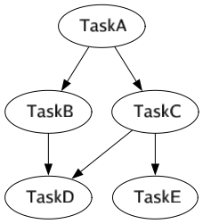

# light-flow

## Introduction

light-flow is a task arrange framework.

Designed to provide the most efficient orchestration and execution strategy for tasks with dependencies.

## Features

**Efficient Task Planning**: The framework allows you to define task dependencies, 
enabling the efficient planning and sequencing of steps based on their relationships

**Context Connect And Isolation**: Tasks can only access to the context of dependent tasks up to the root task.
Modifications to the context by the current task will not affect disconnected tasks.

**Rich Test Case**:  Test cases cover every public API and most scenarios.

**Minimal Code Requirement**: With this framework, you only need to write a minimal amount of code to define and execute your tasks. 

**Task Dependency Visualization**:The framework provides a draw plugin to visualize the dependencies between tasks. 

## Installation

Install the framework by running the following command:

`go get gitee.com/MetaphysicCoding/light-flow`

## Draw your flow

### Step 1: Define Step Functions

Define the step functions that will be executed in the workflow. 

Each step function should have a specific signature and return result and errors.

```go
import (
	"fmt"
	flow "gitee.com/MetaphysicCoding/light-flow"
	"time"
)

func Step1(ctx *flow.Context) (any, error) {
    // If we have previously set the 'name' in input
    // then we can retrieve the 'name'
	name, exist := ctx.Get("name")
	if exist {
		fmt.Printf("step1 get 'name' from ctx: %s \n", name.(string))
	}
	ctx.Set("age", 18)
	return "finish", nil
}

func Step2(ctx *flow.Context) (any, error) {
    // If we have previously set the 'name'in the dependent steps, 
    // then we can retrieve the 'name'
	age, exist := ctx.Get("age")
	if exist {
		fmt.Printf("step2 get 'age' from ctx: %d \n", age.(int))
	}
	result, exist := ctx.GetStepResult("Step1")
	if exist {
		fmt.Printf("step2 get result from step1: %s \n", result.(string))
	}
	return nil, nil
}
```

### Step 2: Register Work-Flow And Process

**After register, you could add current process in another work-flow. **

**And you cloud merge another process into current process, usage see in advance usage**

```go
func init() {
	workflow := flow.RegisterFlow("MyFlow")
	config := flow.ProcessConfig{
		StepRetry:   3,
		StepTimeout: 30 * time.Minute,
	}
    // Processes of workflow are parallel
	process := workflow.AddProcess("MyProcess", &config)
	process.AddStep(Step1)
    // Identify Step 1 as a dependency of Step 2
	process.AddStepWithAlias("Step2", Step2, Step1)
}
```

### Step 3: Add Step And Define Dependencies

```go
func init() {
	...
	process := workflow.AddProcess("MyProcess", &config)
    // AddStep automatically uses "Step1" as step name
	process.AddStep(Step1)
    // AddStepWithAlias use alias "Step2" as the step name
    // Identify Step 1 as a dependency of Step 2
	process.AddStepWithAlias("Step2", Step2, Step1)
}
```

### Step 4: Run Work-Flow

```go
func main() {
    // Done flow run work-flow and block until all processes are completed.
    // If you want to run  asynchronously, you could use AsyncFlow in stead
    // AsyncFlow can stop and pause the workflow or process.
	features := flow.DoneFlow("MyFlow", map[string]any{"name": "foo"})
}
```

### Step 5: Get Execute Result By Features

```go
func main() {
	features := flow.DoneFlow("MyFlow", map[string]any{"name": "foo"})
	for processName, feature := range features {
        // ExplainStatus compresses the status of all steps in the process.
        // The status includes Success, Failed, Error, Timeout, and Panic.
        // More status define see in common.go
		explain := feature.ExplainStatus()
		fmt.Printf("process[%s] explain=%s\n", processName, explain)
		if !feature.Success() {
			fmt.Printf("process[%s] run fail\n", processName)
		}
	}
}
```

### Complete Example

```go
import (
	"fmt"
	flow "gitee.com/MetaphysicCoding/light-flow"
	"time"
)

func Step1(ctx *flow.Context) (any, error) {
	name, exist := ctx.Get("name")
	if exist {
		fmt.Printf("step1 get 'name' from ctx: %s \n", name.(string))
	}
	ctx.Set("age", 18)
	return "finish", nil
}

func Step2(ctx *flow.Context) (any, error) {
	age, exist := ctx.Get("age")
	if exist {
		fmt.Printf("step2 get 'age' from ctx: %d \n", age.(int))
	}
	result, exist := ctx.GetStepResult("Step1")
	if exist {
		fmt.Printf("step2 get result from step1: %s \n", result.(string))
	}
	return nil, nil
}

func init() {
	workflow := flow.RegisterFlow("MyFlow")
	config := flow.ProcessConfig{
		StepRetry:   3,
		StepTimeout: 30 * time.Minute,
	}
	process := workflow.AddProcess("MyProcess", &config)
	process.AddStep(Step1)
	process.AddStepWithAlias("Step2", Step2, Step1)
}

func main() {
	features := flow.DoneFlow("MyFlow", map[string]any{"name": "foo"})
	for processName, feature := range features {
		explain := feature.ExplainStatus()
		fmt.Printf("process[%s] explain=%s\n", processName, explain)
		if !feature.Success() {
			fmt.Printf("process[%s] run fail\n", processName)
		}
	}
}
```

## Advance Usage

### Depends

1. Depends indicates that the current step will not be executed until all dependent steps are completed.
2. flow.Context use adjacency list as data structure. The current step can only access context from dependent steps up to the root step.

### Context Connect And Isolation

We define dependencies like flow code.

```go
workflow := flow.RegisterFlow("MyFlow")
process := workflow.AddProcess("MyProcess", nil)
process.AddStep(TaskA)
process.AddStep(TaskB, TaskA)
process.AddStep(TaskC, TaskA)
process.AddStep(TaskD, TaskB, TaskC)
process.AddStep(TaskE, TaskC)
```

The dependency relationship is shown in the figure



TaskD can access the context of TaskB，TaskC，TaskA.

TaskE can access the context of TaskC，TaskA, but TaskE can't access the context of TaskB.

```
Note:  
Key first match in its own context, then matched in parents context, 
finally matched in global contxt.

You can use AddPriority to break the order 
```

### Process Reuse And Merge

You can add a registered process to the work-flow and merge a registered process into the current process.

```go
workflow := flow.RegisterFlow("MyFlow")
// Add a registered process called 'RegisterProcess' to the current workflow.
workflow.AddRegisterProcess("RegisterProcess")

process := workflow.AddProcess("MyProcess", nil)
// Merge process called 'AnotherProcess' to the current process.
process.Merge("AnotherProcess")
// You can merge a process to the current process at any position, 
// and you can still add your own steps both before and after the merge operation.
process.AddStep(TaskA)
```

**Merge will eliminates duplicate steps and merges the dependencies of duplicate steps after deduplication.**

**If merge creates a cycle, then Merge method will panic and it indicates which two steps form the cycle.**

