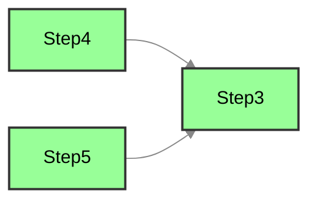
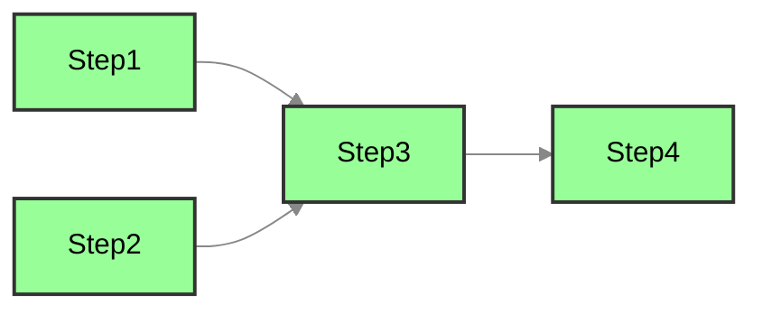
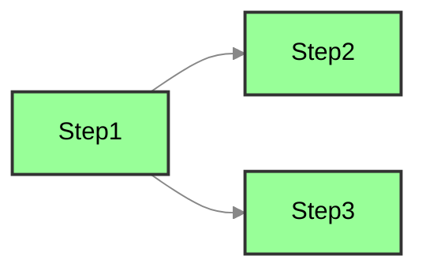
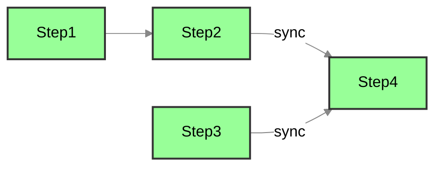

# 编排

## 概述

LightFlow 是一个基于 Go 语言的任务编排框架，旨在通过函数式编程简化任务流的设计与管理。用户可以直接在代码中定义任务流，关注任务的执行时机，从而避免了繁琐的配置文件或规则语言。

---

## 编排流程

### 创建和注册 Flow 与 Process

通过使用 `flow.FlowWithProcess(name)`，可以同时创建并注册一个名为 `name` 的 Flow 和 Process。Flow 和 Process 的名称相同，以便于管理。

```go
process := flow.FlowWithProcess("ExampleFlow")
wf := process.Flow() // 获取工作流
```

### 注册 Flow

当一个 Flow 需要包含多个 Process 时，可以使用 `flow.RegisterFlow(name)` 注册 Flow，并通过 `wf.Process(pname)` 创建相应的 Process。

```go
wf := flow.RegisterFlow("ExampleFlow")
process1 := wf.Process("Process1")
process2 := wf.Process("Process2")
```

### 执行时机

LightFlow 专注于任务的执行时机，允许通过多种方式指定任务的执行顺序：

- **函数（Function）**：当使用函数作为执行时机时，框架会自动解析该函数的名称，并将其作为当前任务的依赖名称。
- **字符串（String）**：可以直接使用字符串来指定依赖的任务名称。
- **同步点（SyncPoint）**：在进行并行编排时，可以生成同步点，并将其作为后续任务的执行时机。这意味着后续任务将在指定的同步点完成后执行。

> **注意事项**
>
> 在所有示例代码中，`Step1`、`Step2`、`Step3` 等步骤都是以 `func(step flow.Step) (any, error)` 形式定义的函数。
>
> `process` 变量均为通过 `flow.FlowWithProcess(name)` 创建的流程。

### 自定义步骤

使用 `flow.CustomStep(func, name, depends...)` 向 Process 添加一个执行步骤，将 `name` 作为步骤名，而 `depends` 则为执行时机。

**示例1：使用字符串指定执行时机**

```go
process.CustomStep(Step3, "Step3", "Step1", "Step2")
```

在此示例中，`Step3` 将在 `Step1` 和 `Step2` 都执行完毕后再执行。

**示例2：使用函数指定执行时机**

```go
process.CustomStep(Step3, "Step3", Step1, Step2)
```

在此示例中，`Step1`、`Step2` 和 `Step3` 都是同一类型的函数，`Step3` 将在 `Step1` 和 `Step2` 执行完毕后再执行。

**示例3：使用同步点指定执行时机**

```go
point := process.Parallel(Step4, Step5)
process.CustomStep(Step3, "Step3", point)
```



在此示例中，`point` 是并行编排后产生的执行点，`Step3` 将在 `Step4` 和 `Step5` 都执行完毕后再执行。

### 任务同步执行

使用 `Follow(...)` 方法可以将步骤按顺序连接，使其在前面的步骤完成后执行。这种方式适用于清晰地定义步骤间的执行顺序。`After` 指定执行时机的方式与 `CustomStep` 相同。

```go
process.Follow(Step3, Step4).After(Step1, Step2)
```



### 任务的并行与依赖

使用 `proc.Parallel(...)` 方法定义多个步骤并行执行，并使用 `After(...)` 方法指定执行时机。

```go
process.Parallel(Step2, Step3).After(Step1)
```



### 任务等待所有任务完毕后执行

使用 `process.SyncAll(func, name)` 方法确保当前已加入的所有步骤执行完毕后再执行特定的步骤。

```go
process.Follow(Step1, Step2)
process.Follow(Step3)
process.SyncAll(Step4, "Step4") // Step4将在Step1、Step2和Step3都执行完毕后执行
```



---