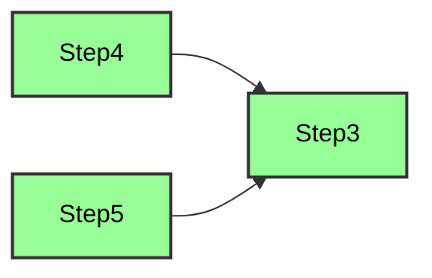
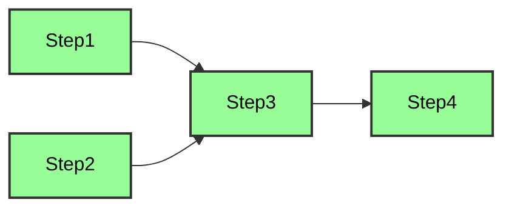
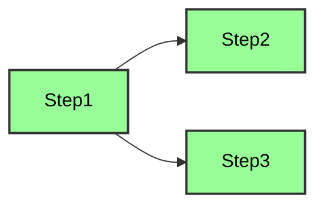
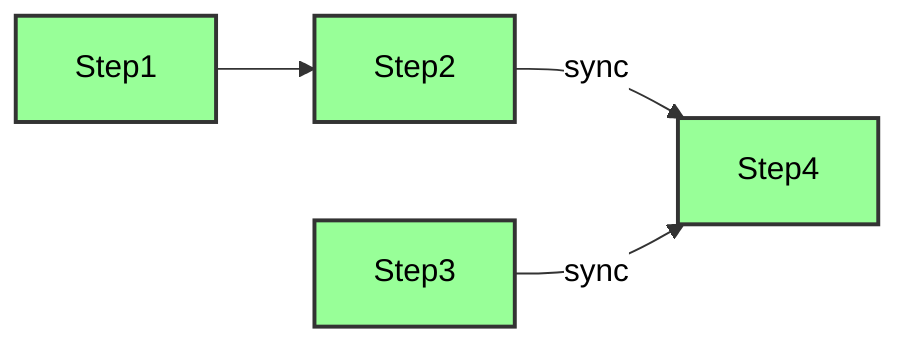

# Orchestration

## Overview

LightFlow is a task orchestration framework built in Go, designed to simplify the design and management of task flows using functional programming. Users can define task flows directly in code, focusing on when tasks should execute, which avoids the hassle of complex configuration files or rule languages.

---

## Orchestration Process

### Creating and Registering Flow and Process

You can create and register a Flow and Process with the same name by using `flow.FlowWithProcess(name)`. This makes management easier.

```go
process := flow.FlowWithProcess("ExampleFlow")
wf := process.Flow() // Get the workflow
```

### Registering Flow

When a Flow needs to include multiple Processes, you can register the Flow using `flow.RegisterFlow(name)` and create the corresponding Processes with `wf.Process(pname)`.

```go
wf := flow.RegisterFlow("ExampleFlow")
process1 := wf.Process("Process1")
process2 := wf.Process("Process2")
```

### Execution Timing

LightFlow focuses on  the timing of task execution,  allowing you to specify execution order in several ways:

- **Function**: When using a function as the timing method, the framework automatically resolves the function name as the dependency name for the current task.
- **String**: You can directly use a string to specify the name of the dependent task.
- **SyncPoint**: When orchestrating tasks in parallel, you can create a sync point to serve as the timing for subsequent tasks. This means later tasks will execute only after the specified sync point is reached.

> **Note**
>
> In all example code, steps like `Step1`, `Step2`, and `Step3` are defined as functions in the form `func(step flow.Step) (any, error)`.
>
> The `process` variable is created using `flow.FlowWithProcess(name)`.

### Custom Steps

Use `flow.CustomStep(func, name, depends...)` to add an execution step to a Process. Here, `name` is the step name, and `depends` indicates the timing for execution.

**Example 1: Using a String to Specify Execution Timing**

```go
process.CustomStep(Step3, "Step3", "Step1", "Step2")
```

In this example, `Step3` will run after both `Step1` and `Step2` have completed.

**Example 2: Using a Function to Specify Execution Timing**

```go
process.CustomStep(Step3, "Step3", Step1, Step2)
```

Here, `Step1`, `Step2`, and `Step3` are all the same type of function, and `Step3` will execute after `Step1` and `Step2` finish.

**Example 3: Using a Sync Point to Specify Execution Timing**

```go
point := process.Parallel(Step4, Step5)
process.CustomStep(Step3, "Step3", point)
```



In this case, `point` is the execution point generated from the parallel orchestration, and `Step3` will run after both `Step4` and `Step5` complete.

### Synchronous Task Execution

You can connect steps sequentially using the `Follow(...)` method, ensuring they execute after preceding steps. The way to specify execution timing with `After` is the same as with `CustomStep`.

```go
process.Follow(Step3, Step4).After(Step1, Step2)
```



### Parallel Tasks and Dependencies

Use the `proc.Parallel(...)` method to define multiple steps that run in parallel and specify timing with the `After(...)` method.

```go
process.Parallel(Step2, Step3).After(Step1)
```



### Waiting for All Tasks to Complete

The `process.SyncAll(func, name)` method ensures that a specific step runs only after all previously added steps have completed.

```go
process.Follow(Step1, Step2)
process.Follow(Step3)
process.SyncAll(Step4, "Step4") // Step4 will run after Step1, Step2, and Step3 are all finished
```


