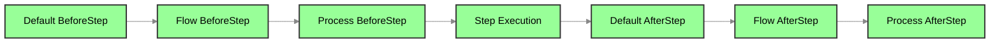
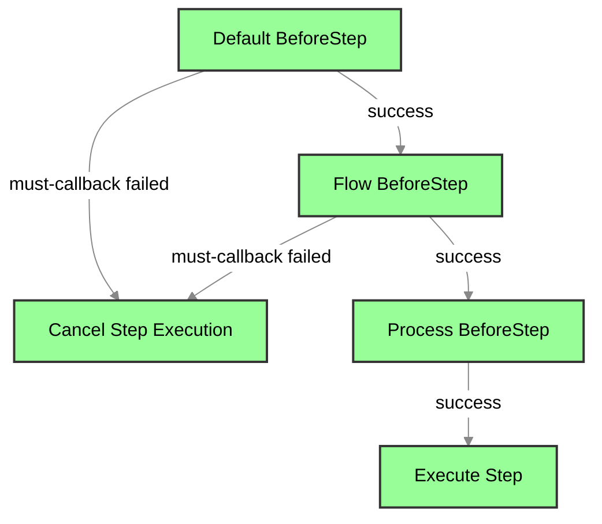
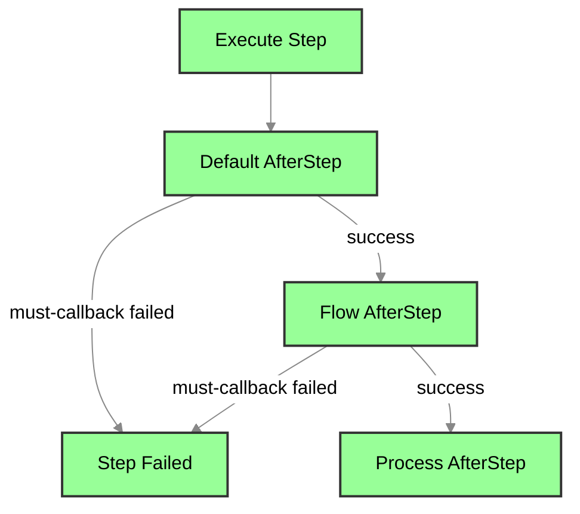

# 多级回调

### 0. 使用建议

- 大多数情况下，只需使用 **Default 回调** 配合 `For` 和 `NotFor` 方法即可满足需求。`Flow` 和 `Process` 层级的回调配置适用于更复杂的场景，例如测试平台或需要大量验证的任务编排。

---

### 1. 分层执行

回调可以在 **Flow**、**Process** 和 **Step** 这三个层级上定义前置（Before）和后置（After）回调，并根据其来源层级按顺序执行。

- **回调层级**：
  1. **Default**：全局回调，适用于所有 Flow、Process 和 Step。
  2. **Flow**：特定 Flow 的回调，可以覆盖 Default 回调。
  3. **Process**：特定 Process 的回调，可以覆盖 Flow 和 Default 的回调。

**Step 回调执行顺序**：



- 回调的执行遵循层级顺序，即 Default 回调优先执行，接着是 Flow 和 Process，确保不同层级的回调以合理顺序被执行。

**示例1 多级回调**

```go
df := flow.DefaultCallback()
wf := flow.RegisterFlow("FlowLevel")
process := wf.Process("ProcessLevel")

// Set AfterStep callbacks at Default, Flow, and Process levels
df.AfterStep(true, StepCallback) // Default level callback
wf.AfterStep(true, StepCallback)   // Flow level callback
process.AfterStep(true, StepCallback) // Process level callback
```

**示例2 各层级设置回调**

```go
df := flow.DefaultCallback()
// FlowCallback -> func(flow flow.WorkFlow) (bool, error)
df.BeforeFlow(true, FlowCallback)
// ProcCallback -> func(proc flow.Process) (bool, error)
df.BeforeProcess(true, ProcCallback)
// StepCallback -> func(step flow.Step) (bool, error)
df.BeforeStep(true, StepCallback)
df.AfterStep(true, StepCallback)
df.AfterProcess(true, ProcCallback)
df.AfterFlow(true, FlowCallback)
```

---

### 2. 回调的状态与单元控制

用户可以通过 **状态** 和 **单元** 来精确控制回调的执行时机：

- **状态控制**：使用 `When` 或 `Exclude` 方法，限定回调仅在特定状态下执行或不执行。例如，限定回调只在 `flow.Failed` 状态下触发。
- **单元控制**：使用 `For` 或 `NotFor` 方法，限定回调只在特定单元（Flow、Process、Step）执行，或在某些单元中不执行。
- **条件执行**：使用 `If` 方法，使回调在满足某个条件函数返回 `true` 时才执行。

#### 正常状态

- **Success**：表示执行完毕且成功。
- **Suspend**：当前层级可恢复且进入挂起状态。
- **Recovering**：当前层级上次执行失败，本次进行断点恢复。

#### 异常状态

- **Failed**：表示执行完毕且失败。
- **Error**：Step 执行返回错误。
- **Panic**：Step 执行引发 panic。
- **CallbackFail**：当前层级必要回调返回错误或执行 panic。
- **Timeout**：当前层级执行超时。

**示例**：

```go
import (
	"errors"
	"fmt"
	"github.com/Bilibotter/light-flow/flow"
)

// Handle error logging
func DealError(err error) {}

// Step callback function
func StepCallback(step flow.Step) (keepOn bool, err error) {
	fmt.Printf("Executing %s callback\n", step.Name())
	// Check for Error or CallbackFail states
	if step.Has(flow.Error) || step.Has(flow.CallbackFail) {
		DealError(step.Err())
		return true, nil
	}
	if step.Has(flow.Panic) {
		// Handle panic situation
	}
	return true, nil
}

// Process callback function
func ProcCallback(proc flow.Process) (keepOn bool, err error) {
	// Check for any panic in process steps
	if proc.HasAny(flow.Panic) {
		// Handle panic situation
	}
	return true, nil
}

// Flow callback function
func FlowCallback(flow flow.WorkFlow) (keepOn bool, err error) {
	// Additional logic can be added here
	return true, nil
}

// Step that simulates an error
func ErrorStep(step flow.Step) (any, error) {
	fmt.Printf("Executing %s\n", step.Name())
	return nil, errors.New("something went wrong")
}

// Step that simulates a panic
func PanicStep(step flow.Step) (any, error) {
	fmt.Printf("Executing %s\n", step.Name())
	panic("something went wrong")
}

func init() {
	df := flow.DefaultCallback()
	// Set necessary callbacks with state control
	df.AfterStep(true, StepCallback).When(flow.Failed)
	df.AfterProcess(true, ProcCallback).OnlyFor("CallbackExample")
	df.AfterFlow(true, FlowCallback)

	process := flow.FlowWithProcess("CallbackExample")
	process.Parallel(ErrorStep, PanicStep)
}

func main() {
	flow.DoneFlow("CallbackExample", nil)
}
```

这些控制方法让回调的执行更加灵活，确保回调只在合适的上下文中运行，避免无效的执行。

---

### 3. 必要与非必要回调

回调可以分为 **必要回调** 和 **非必要回调**，两者的执行效果不同：

- **非必要回调**：注册回调时，将 `must` 参数设为 `false`。如果非必要回调失败，任务继续执行，不会中断流程。这类回调适合执行如日志记录、通知等非关键任务。
- **必要回调**：注册回调时，将 `must` 参数设为 `true`。如果必要回调失败，将导致当前单元（Flow 或 Process）中断，或相关步骤被跳过。必要回调的失败视为任务失败，保证任务的关键逻辑不被忽略。

**示例**：

```go
df := flow.DefaultCallback()
// StepCallback is set as a necessary callback
df.AfterStep(true, StepCallback)
// StepCallback is set as a non-necessary callback
df.AfterStep(false, StepCallback)
```

**前置回调执行顺序与必要回调失败的影响**：



**后置回调执行顺序与必要回调失败的影响**：



---

### 4. `DisableDefaultCallback` 控制

- 通过 `DisableDefaultCallback`，可以在 `Flow` 或 `Process` 层级禁用默认回调。这意味着特定的 Flow 或 Process 不会执行全局默认回调，而其他 Flow 和 Process 依然可以执行。

  **示例**

  ```go
  wf := flow.RegisterFlow("FlowLevel")
  process := wf.Process("ProcessLevel")
  
  // DisableDefaultCallback() in Flow
  wf.DisableDefaultCallback()
  // DisableDefaultCallback() in Process
  process.DisableDefaultCallback()
  ```

  

- 如果回调失败，系统会记录日志，显示失败回调的层级（Default、Process 或 Flow），回调链中的顺序及类型（Flow、Process、Step），帮助用户进行调试和问题排查。

  **示例**

  ```go
  logger, err := zap.NewProduction()
  if err != nil {
      panic(err)
  }
  flow.SetLogger(logger.Sugar())
  ```

  使用zap的日志替代默认的日志实现。

---

### 5. 链式调用与中断机制

回调机制支持 **链式调用**，允许用户通过返回 `false` 来中断回调链的执行，但这种中断只限于当前层级：

- **Default 层级中断**：当 Default 层级的回调中断后，Flow 和 Process 层级的回调仍会继续执行，保证不同层级之间的独立性。

- **中断控制**：这种设计允许用户在每个层级上精准控制回调的执行，同时保持不同层级之间的隔离，避免不必要的干扰。

