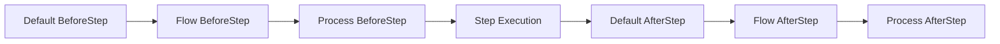
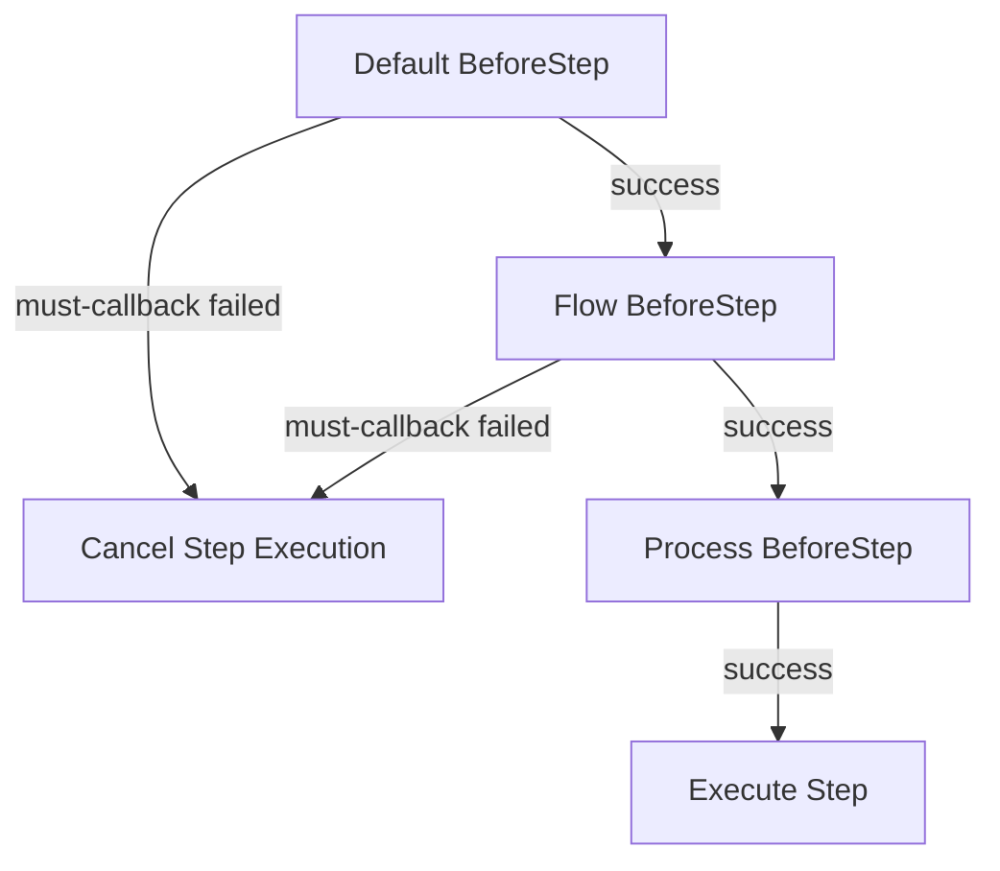
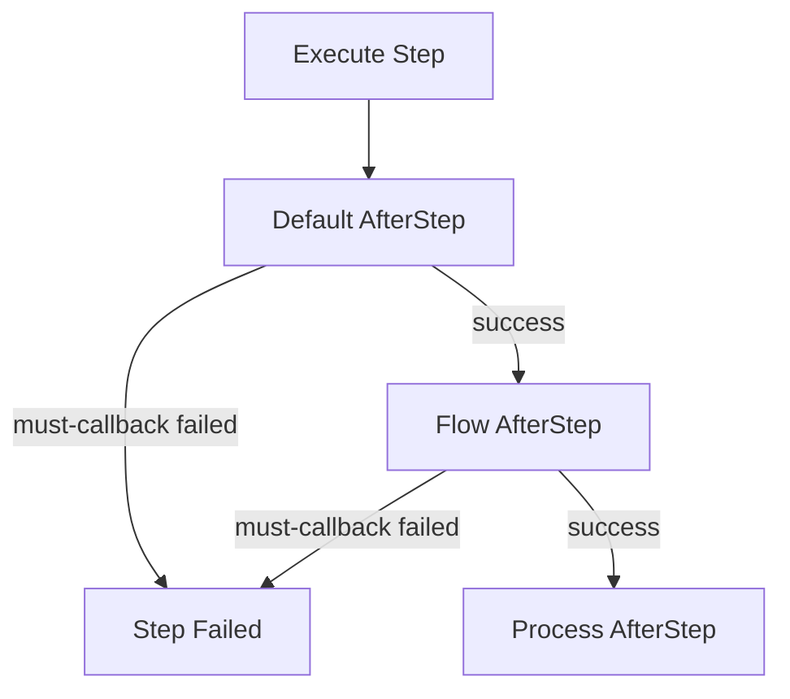

# Multi-level Callbacks

### 0. Usage Recommendations

In most cases, simply using the **Default Callback** along with the `For` and `NotFor` methods will meet your needs. Callbacks configured at the Flow and Process levels are suitable for more complex scenarios, such as testing platforms or task orchestrations requiring extensive validation.

---

### 1. Layered Execution

Callbacks can be defined at three levels—**Flow**, **Process**, and **Step**—allowing for both pre-execution (Before) and post-execution (After) callbacks, which are executed in the order of their source level.

- **Callback Levels**:
  1. **Default**: A global callback applicable to all Flows, Processes, and Steps.
  2. **Flow**: A callback specific to a particular Flow that can override the Default callback.
  3. **Process**: A callback specific to a particular Process that can override both Flow and Default callbacks.

**Step Callback Execution Order**:



Callbacks are executed in the order of their levels, ensuring that Default callbacks are executed first, followed by Flow and Process callbacks, maintaining a logical sequence.

**Example 1: Multi-level Callbacks**

```go
df := flow.DefaultCallback()
wf := flow.RegisterFlow("FlowLevel")
process := wf.Process("ProcessLevel")

// Set AfterStep callbacks at Default, Flow, and Process levels
df.AfterStep(true, StepCallback) // Default level callback
wf.AfterStep(true, StepCallback)   // Flow level callback
process.AfterStep(true, StepCallback) // Process level callback
```

**Example 2: Setting Callbacks at Each Level**

```go
df := flow.DefaultCallback()
// FlowCallback -> func(flow flow.WorkFlow) (bool, error)
df.BeforeFlow(true, FlowCallback)
// ProcCallback -> func(proc flow.Process) (bool, error)
df.BeforeProcess(true, ProcCallback)
// StepCallback -> func(step flow.Step) (bool, error)
df.BeforeStep(true, StepCallback)
df.AfterStep(true, StepCallback)
df.AfterProcess(true, ProcCallback)
df.AfterFlow(true, FlowCallback)
```

---

### 2. Callback State and Unit Control

Users can precisely control when callbacks are executed through **state** and **unit** management:

- **State Control**: Use `When` or `Exclude` methods to restrict callbacks to execute only in specific states or not execute in others. For instance, triggering callbacks only when the state is `flow.Failed`.
- **Unit Control**: Use `For` or `NotFor` methods to limit callback execution to specific units (Flow, Process, Step) or to exclude certain units.
- **Conditional Execution**: Use the `If` method to ensure callbacks execute only if a certain condition function returns `true`.

#### Normal States

- **Success**: Indicates successful execution.
- **Suspend**: The current level can be resumed and has entered a suspended state.
- **Recovering**: Indicates the last execution at this level failed, and this execution is for breakpoint recovery.

#### Exception States

- **Failed**: Indicates execution has completed with failure.
- **Error**: Indicates the Step execution returned an error.
- **Panic**: Indicates the Step execution triggered a panic.
- **CallbackFail**: Indicates a necessary callback returned an error or triggered a panic at the current level.
- **Timeout**: Indicates execution at the current level timed out.

**Example**:

```go
import (
	"errors"
	"fmt"
	"github.com/Bilibotter/light-flow/flow"
)

// Handle error logging
func DealError(err error) {}

// Step callback function
func StepCallback(step flow.Step) (keepOn bool, err error) {
	fmt.Printf("Executing %s callback\n", step.Name())
	// Check for Error or CallbackFail states
	if step.Has(flow.Error) || step.Has(flow.CallbackFail) {
		DealError(step.Err())
		return true, nil
	}
	if step.Has(flow.Panic) {
		// Handle panic situation
	}
	return true, nil
}

// Process callback function
func ProcCallback(proc flow.Process) (keepOn bool, err error) {
	// Check for any panic in process steps
	if proc.HasAny(flow.Panic) {
		// Handle panic situation
	}
	return true, nil
}

// Flow callback function
func FlowCallback(flow flow.WorkFlow) (keepOn bool, err error) {
	// Additional logic can be added here
	return true, nil
}

// Step that simulates an error
func ErrorStep(step flow.Step) (any, error) {
	fmt.Printf("Executing %s\n", step.Name())
	return nil, errors.New("something went wrong")
}

// Step that simulates a panic
func PanicStep(step flow.Step) (any, error) {
	fmt.Printf("Executing %s\n", step.Name())
	panic("something went wrong")
}

func init() {
	df := flow.DefaultCallback()
	// Set necessary callbacks with state control
	df.AfterStep(true, StepCallback).When(flow.Failed)
	df.AfterProcess(true, ProcCallback).OnlyFor("CallbackExample")
	df.AfterFlow(true, FlowCallback)

	process := flow.FlowWithProcess("CallbackExample")
	process.Parallel(ErrorStep, PanicStep)
}

func main() {
	flow.DoneFlow("CallbackExample", nil)
}
```

These control methods enhance the flexibility of callback execution, ensuring that callbacks run only in appropriate contexts and preventing unnecessary executions.

---

### 3. Necessary vs. Non-Necessary Callbacks

Callbacks can be classified into **necessary callbacks** and **non-necessary callbacks**, each affecting execution differently:

- **Non-Necessary Callbacks**: When registering a callback, set the `must` parameter to `false`. If a non-necessary callback fails, the task continues without interrupting the flow. Such callbacks are suitable for tasks like logging or notifications, which are not critical.
- **Necessary Callbacks**: When registering a callback, set the `must` parameter to `true`. If a necessary callback fails, it will cause the current unit (Flow or Process) to be interrupted, or related steps to be skipped. The failure of necessary callbacks is treated as a task failure, ensuring critical logic is not overlooked.

**Example**:

```go
df := flow.DefaultCallback()
// StepCallback is set as a necessary callback
df.AfterStep(true, StepCallback)
// StepCallback is set as a non-necessary callback
df.AfterStep(false, StepCallback)
```

**Impact of Failure in Necessary Callbacks on Pre-Execution Order**:



**Impact of Failure in Necessary Callbacks on Post-Execution Order**:



---

### 4. Controlling with `DisableDefaultCallback`

- The `DisableDefaultCallback` method allows you to disable the default callbacks at the Flow or Process level. This means specific Flows or Processes will not execute global default callbacks while other Flows and Processes can still do so.

  **Example**:

  ```go
  wf := flow.RegisterFlow("FlowLevel")
  process := wf.Process("ProcessLevel")
  
  // DisableDefaultCallback() in Flow
  wf.DisableDefaultCallback()
  // DisableDefaultCallback() in Process
  process.DisableDefaultCallback()
  ```

- If a callback fails, the system logs an error indicating the level of the failed callback (Default, Process, or Flow), the order and type of callbacks in the chain (Flow, Process, Step), assisting users with debugging and troubleshooting.

  **Example**:

  ```go
  logger, err := zap.NewProduction()
  if err != nil {
      panic(err)
  }
  flow.SetLogger(logger.Sugar())
  ```

  Using zap's logging to replace the default logging implementation.

---

### 5. Chaining Calls and Interruption Mechanism

The callback mechanism supports **chaining calls**, allowing users to interrupt the execution of the callback chain by returning `false`, but this interruption is limited to the current level:

- **Default Level Interruption**: When a callback at the Default level interrupts, callbacks at the Flow and Process levels will continue to execute, ensuring independence between different levels.

- **Interruption Control**: This design allows users to precisely control callback execution at each level while maintaining isolation between different levels to avoid unnecessary interference.