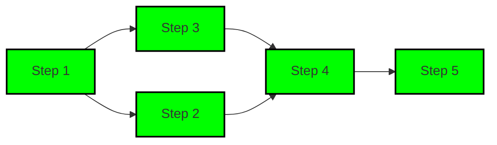
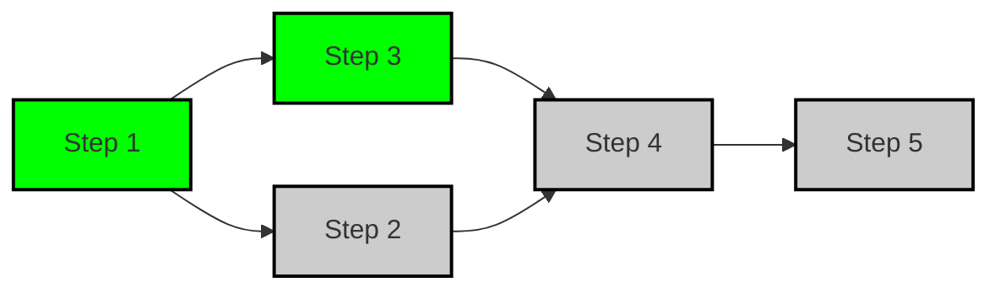

# Condition

#### 1. 简介

条件编排为Light-Flow引入了基于条件的动态执行控制机制。通过设定条件，可以灵活地决定某个 Step 是否执行，从而优化任务流，避免不必要的步骤执行，确保任务路径根据实际情况进行调整。

---

#### 2. 条件编排概念

每个 Step 都可以设定执行条件。只有当这些条件在运行时被满足时，步骤才会执行。条件判断基于 Context 中的键值，系统支持多种比较操作符，并允许多个条件的组合使用。**~~设置Context文档的路径。~~**

---

#### 3. 条件运算符

条件编排支持以下常见的比较操作符：

- **EQ(key, value)**: 当 `key` 的值等于 `value` 时执行。
- **NEQ(key, value)**: 当 `key` 的值不等于 `value` 时执行。如果 `key` 不存在，默认视为条件满足。
- **GT(key, value)**: 当 `key` 的值大于 `value` 时执行。
- **GTE(key, value)**: 当 `key` 的值大于或等于 `value` 时执行。
- **LT(key, value)**: 当 `key` 的值小于 `value` 时执行。
- **LTE(key, value)**: 当 `key` 的值小于或等于 `value` 时执行。

---

#### 4. 条件组合 (AND/OR)

多个条件可以组合使用，默认采用 `AND` 逻辑，即所有条件必须同时满足，步骤才会执行。系统也支持 `OR` 逻辑，满足任意一个条件即可执行。

- **AND**：多个条件同时成立时执行（默认行为），不需要显式调用。
- **OR**：多个条件中任意一个满足时执行。

**示例**：

```go
proc := flow.FlowWithProcess("Condition")
proc.CustomStep(Step2, "Step2").
    EQ("temperature", 30).GT("pressure", 10).
    OR().NEQ("humidity", 50) // Step 2 executes if either condition is met
```

**解释**：`Step 2`将在满足以下两个条件之一时执行：

- `temperature` 等于 30 且 `pressure` 大于 10，或
- `humidity` 不等于 50。

---

#### 5. 跳过策略

如果某个步骤的条件不满足，编排系统提供两种跳过策略：

- **跳过当前步骤**：仅跳过不符合条件的当前步骤，其它步骤不受影响。这是默认策略。
- **跳过依赖步骤**：若当前步骤被跳过，其所有依赖步骤也会跳过执行。通过 `SkipWithDependents()` 设置。

**示例**： 假设流程如下：



如果 `Step 2` 设置了条件和 `SkipWithDependents()` 且条件未满足，则 `Step 2` 和依赖`Step 2`的 `Step 4`、`Step 5`都会被跳过：



**示例**：

```go
import (
    "fmt"
    "github.com/Bilibotter/light-flow/flow"
)

func Step1(step flow.Step) (any, error) {
    fmt.Printf("Executing Step 1\n")
    step.Set("humidity", 50)
    return nil, nil
}

func Step2(_ flow.Step) (any, error) {
    fmt.Printf("Executing Step 2\n")
    return nil, nil
}

func Step3(_ flow.Step) (any, error) {
    fmt.Printf("Executing Step 3\n")
    return nil, nil
}

func Step4(_ flow.Step) (any, error) {
    fmt.Printf("Executing Step 4\n")
    return nil, nil
}

func Step5(_ flow.Step) (any, error) {
    fmt.Printf("Executing Step 5\n")
    return nil, nil
}

func init() {
    proc := flow.FlowWithProcess("Condition")
    proc.Follow(Step1, Step3)
    proc.CustomStep(Step2, "Step2", Step1).
        EQ("temperature", 30).GT("pressure", 10).
        OR().NEQ("humidity", 50).SkipWithDependents() // Set conditions and skip dependencies
    proc.Follow(Step4, Step5).After(Step2)
}

func main() {
    flow.DoneFlow("Condition", nil)
}
```

---

#### 6. 自定义类型支持

除了基础类型（如 `bool`、`int` 等）和时间类型，条件编排还支持自定义类型，只需实现以下接口：

- **Equality 接口**: 支持 `EQ` 和 `NEQ` 运算符。

  ```go
  type Equality interface {
      Equal(other any) bool
  }
  ```

- **Comparable 接口**: 支持 `EQ`、`NEQ`、`GT`、`GTE`、`LT`、`LTE` 运算符。

  ```go
  type Comparable interface {
      Equal(other any) bool
      Less(other any) bool
  }
  ```

通过实现这些接口，用户可以为复杂类型定制条件判断逻辑，进一步增强编排的灵活性。

