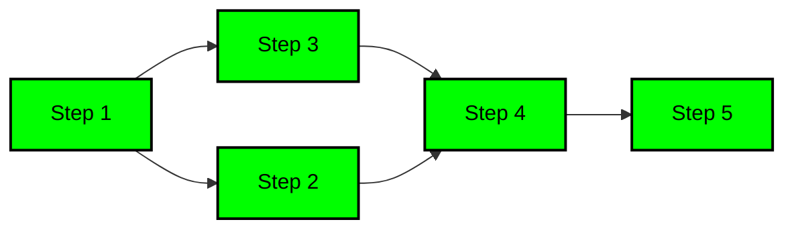
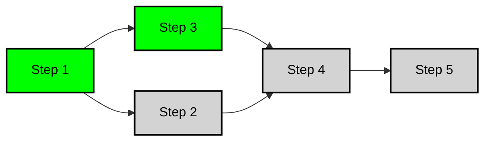

# Condition

#### 1. Introduction

Condition orchestration introduces a dynamic execution control mechanism based on conditions in Light-Flow. By setting conditions, you can flexibly decide whether a specific step should execute, optimizing the task flow and avoiding unnecessary step execution, ensuring that the task path adjusts according to actual circumstances.

---

#### 2. Concept of Condition Orchestration

Each step can have execution conditions defined. Steps will only execute when these conditions are met during runtime. Condition evaluations are based on key-value pairs within the context, and the system supports various comparison operators, allowing for the combination of multiple conditions. [See Context documentation](./Context.en.md).

---

#### 3. Condition Operators

Condition orchestration supports the following common comparison operators:

- **EQ(key, value)**: Executes when the value of `key` equals `value`.
- **NEQ(key, value)**: Executes when the value of `key` does not equal `value`. If `key` does not exist, it is considered satisfied by default.
- **GT(key, value)**: Executes when the value of `key` is greater than `value`.
- **GTE(key, value)**: Executes when the value of `key` is greater than or equal to `value`.
- **LT(key, value)**: Executes when the value of `key` is less than `value`.
- **LTE(key, value)**: Executes when the value of `key` is less than or equal to `value`.

---

#### 4. Condition Combination (AND/OR)

Multiple conditions can be combined, with a default `AND` logic, meaning all conditions must be satisfied for the step to execute. The system also supports `OR` logic, where execution occurs if any condition is met.

- **AND**: Executes when all conditions are true (default behavior), no need for explicit calling.
- **OR**: Executes when any one of the conditions is true.

**Example**:

```go
proc := flow.FlowWithProcess("Condition")
proc.CustomStep(Step2, "Step2").
    EQ("temperature", 30).GT("pressure", 10).
    OR().NEQ("humidity", 50) // Step 2 executes if either condition is met
```

**Explanation**: `Step 2` will execute if either of the following two conditions is met:

- `temperature` equals 30 and `pressure` is greater than 10, or
- `humidity` is not equal to 50.

---

#### 5. Skip Strategies

If the conditions for a step are not met, the orchestration system provides two skip strategies:

- **Skip Current Step**: Only skips the current step that does not meet the conditions, while other steps remain unaffected. This is the default strategy.
- **Skip Dependent Steps**: If the current step is skipped, all its dependent steps will also be skipped. This can be set using `SkipWithDependents()`.

**Example**: Suppose the workflow is as follows:



If `Step 2` has conditions set and uses `SkipWithDependents()`, and those conditions are not met, both `Step 2` and its dependent steps (`Step 4`, `Step 5`) will be skipped:



**Example**:

```go
import (
    "fmt"
    "github.com/Bilibotter/light-flow/flow"
)

func Step1(step flow.Step) (any, error) {
    fmt.Printf("Executing Step 1\n")
    step.Set("humidity", 50)
    return nil, nil
}

func Step2(_ flow.Step) (any, error) {
    fmt.Printf("Executing Step 2\n")
    return nil, nil
}

func Step3(_ flow.Step) (any, error) {
    fmt.Printf("Executing Step 3\n")
    return nil, nil
}

func Step4(_ flow.Step) (any, error) {
    fmt.Printf("Executing Step 4\n")
    return nil, nil
}

func Step5(_ flow.Step) (any, error) {
    fmt.Printf("Executing Step 5\n")
    return nil, nil
}

func init() {
    proc := flow.FlowWithProcess("Condition")
    proc.Follow(Step1, Step3)
    proc.CustomStep(Step2, "Step2", Step1).
        EQ("temperature", 30).GT("pressure", 10).
        OR().NEQ("humidity", 50).SkipWithDependents() // Set conditions and skip dependencies
    proc.Follow(Step4, Step5).After(Step2)
}

func main() {
    flow.DoneFlow("Condition", nil)
}
```

---

#### 6. Support for Custom Types

In addition to basic types (such as `bool`, `int`, etc.) and time types, condition orchestration also supports custom types, requiring the implementation of the following interfaces:

- **Equality Interface**: Supports `EQ` and `NEQ` operators.

  ```go
  type Equality interface {
      Equal(other any) bool
  }
  ```

- **Comparable Interface**: Supports `EQ`, `NEQ`, `GT`, `GTE`, `LT`, `LTE` operators.

  ```go
  type Comparable interface {
      Equal(other any) bool
      Less(other any) bool
  }
  ```

By implementing these interfaces, users can customize condition evaluation logic for complex types, enhancing the flexibility of orchestration further.