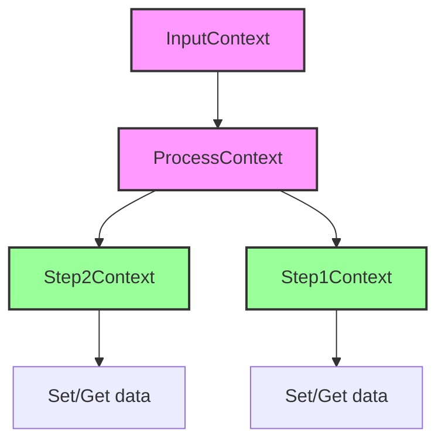
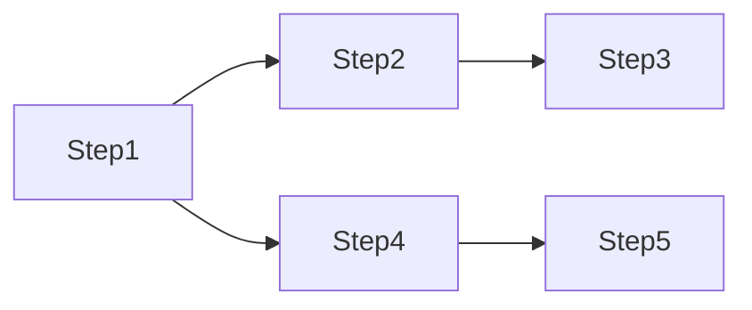

你的 **Context 特性文档** 已经具备良好的结构和内容，但可以通过进一步优化表达和结构，使其更加清晰、易于理解，并突出关键点。以下是改进建议：

1. **更清晰的层次结构**：目前的文档结构已经较为清晰，但有些地方的内容可以进一步归类和简化，使用户能快速找到关键信息。
2. **示例代码的注释和上下文增强**：增加更直观的注释，确保用户理解每一段代码在上下文中的作用，并保持代码与上下文的一致性。
3. **简化技术术语**：某些术语可以更通俗易懂，让用户能快速理解而不需要额外查阅技术文档。

---

### **优化后的 Context 特性文档**

---

### **1. 简介**

在 Light-Flow 中，`Context` 是一个用于在 `Step` 之间传递信息的键值对存取对象。每个 `Step` 可以在执行过程中设置或获取数据。`Context` 设计确保了每个 `Step` 只能访问与其相关联的步骤设置的数据，从而避免数据冲突或不必要的依赖，保证了信息传递的有序性与隔离性。

---

### **2. Context 的基本层级**

`Context` 在 Light-Flow 中分为三个层级，分别用于在不同范围内进行数据存取：

1. **InputContext**：
   - 任务流的初始输入存储在 `InputContext` 中，`Process` 和 `Step` 都可以访问这些数据。

2. **Process 的 Context**：
   - `Process` 的 `Context` 存储数据，并可以访问 `InputContext` 中的数据。每个 `Step` 也能访问所属 `Process` 的 `Context`。

3. **Step 的 Context**：
   - 每个 `Step` 可以存储自己的数据，并访问与其相关的步骤设置的数据。`Step` 只能访问到自己和前置相关步骤的上下文，避免了不必要的数据传递。



---

### **3. Context 的连通与隔离**

为了确保数据传递的有序性，`Context` 实现了步骤间的连通与隔离机制。每个 `Step` 只能访问其关联的前置 `Step` 设置的数据，而其他无关的步骤则不会干扰其 `Context`。

#### 示例执行路径：



在这个流程中：

- **Step1** 和 **Step4** 分别在 `Context` 中设置了 `Name`，值为各自的步骤名。
- **Step3** 可以获取 **Step1** 的 `Name` 值，而 **Step5** 获取的是 **Step4** 的 `Name` 值。

这种隔离确保了不同路径上的步骤互不干扰，各自管理自己的数据。

#### 示例代码：

```go
package main

import (
	"fmt"
	"github.com/Bilibotter/light-flow/flow"
)

func ReceiveInput(step flow.Step) (any, error) {
	// 从 InputContext 中获取 "input" 并设置新键值
	if input, ok := step.Get("input"); ok {
		fmt.Printf("[Step: %s] received input: %s\n", step.Name(), input)
	}
	step.Set("key", "Value")
	return "Hello World!", nil
}

func AccessContext(step flow.Step) (any, error) {
	// 从前置步骤中获取键值并传递给下一个步骤
	if value, ok := step.Get("key"); ok {
		fmt.Printf("[Step: %s] access context: %s\n", step.Name(), value)
	}
	// 获取前置步骤的结果
	if result, ok := step.Result(step.Dependents()[0]); ok {
		fmt.Printf("[Step: %s] received result from %s: %s\n", step.Name(), step.Dependents()[0], result)
	}
	step.Set("key", "UpdatedValue")
	return nil, nil
}

func AccessUpdate(step flow.Step) (any, error) {
	// 从前置步骤中获取更新后的值
	if value, ok := step.Get("key"); ok {
		fmt.Printf("[Step: %s] access updated value: %s\n", step.Name(), value)
	}
	return nil, nil
}

func Isolated(step flow.Step) (any, error) {
	// 未设置任何前置步骤，无法访问前置步骤的键
	if _, ok := step.Get("key"); !ok {
		fmt.Printf("[Step: %s] cannot access Key: %s\n", step.Name(), "key")
	}
	return nil, nil
}

func init() {
	process := flow.FlowWithProcess("Context")
	// 串行执行步骤并传递数据
	process.Follow(ReceiveInput, AccessContext, AccessUpdate)
	process.Follow(Isolated)
}

func main() {
	flow.DoneFlow("Context", map[string]any{"input": "FlowInput"})
}
```

---

### **4. 极端情况处理**

`Context` 提供了针对复杂场景的数据管理工具，包括 `Restrict` 和 `EndValues` 两种特性，帮助用户处理多路径和数据冲突的情况。

#### 4.1 Restrict

`Restrict` 用于指定某个 `Step` 只能从特定的前置步骤中获取指定键，避免数据冲突。

**示例**：

```go
// GetKey 优先从 SetName1 获取 "name" 键，若不存在则按常规方式获取
process.CustomStep(GetKey, "GetKey", SetName1, SetName2).
		Restrict(map[string]any{"name": SetName1})
```

#### 4.2 EndValues

`EndValues` 提供了一种机制来获取当前路径中“末端”步骤设置的键值，特别适合在合并路径中处理多个步骤设置相同键的情况。

**示例**：

```go
func GetKey(step flow.Step) (any, error) {
	// 获取所有末端步骤设置的键值
	for k, v := range step.EndValues("name") {
		fmt.Printf("[Step: %s] set Key to %s\n", k, v)
	}
	return nil, nil
}
```

- **末端值**：在执行路径中，未被后续步骤覆盖的键值即为末端值。
- **多值支持**：合并路径中，若多个步骤设置相同键，`EndValues` 会返回所有这些步骤的末端值。

