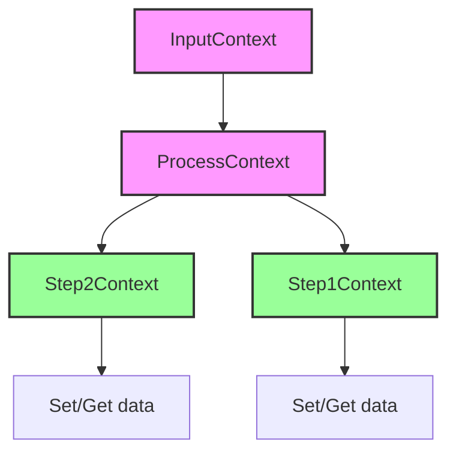
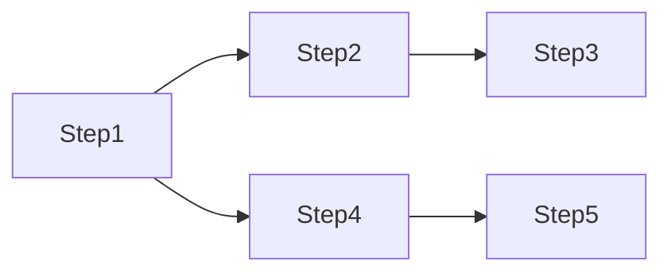

# Context

### **1. Introduction**

In Light-Flow, `Context` is a key-value storage object used for passing information between `Steps`. Each `Step` can set or retrieve data during its execution. The design of `Context` ensures that each `Step` can only access data associated with it, preventing data conflicts and unnecessary dependencies, thus maintaining order and isolation in information transfer.

---

### **2. Basic Hierarchy of Context**

`Context` in Light-Flow is divided into three levels for data storage and retrieval in different scopes:

1. **FlowContext**:

   - The `FlowContext` stores the initial input data for the task flow, accessible to both `Process` and `Step`. It is important to note that `FlowContext` cannot directly access data within `Process` and `Step`, but it can recognize modifications made to data by `BeforeFlow` and `AfterFlow`.

   For detailed definitions of `BeforeFlow` and `AfterFlow`, please refer to the [Callback Documentation](./Callback.md).

2. **Process Context**:

   - The `Process` context stores data and can access data in the `InputContext`. Each `Step` can also access the `Context` of its associated `Process`.

3. **Step Context**:

   - Each `Step` can store its own data and access data set by related preceding steps. A `Step` can only access its own context and that of its direct predecessors, avoiding unnecessary data transfer.



---

### **3. Connectivity and Isolation of Context**

To ensure orderly data transfer, `Context` implements a mechanism for connectivity and isolation between steps. Each `Step` can only access data set by its associated preceding steps, while unrelated steps do not interfere with its `Context`.

#### Example Execution Path



In this flow:

- **Step1** and **Step4** each set a `Name` in their `Context`, with values equal to their respective step names.
- **Step3** can retrieve the `Name` value from **Step1**, while **Step5** gets the `Name` value from **Step4**.

This isolation ensures that steps on different paths do not interfere with each other, each managing its own data.

#### Example

```go
package main

import (
	"fmt"
	"github.com/Bilibotter/light-flow/flow"
)

func ReceiveInput(step flow.Step) (any, error) {
	// Get "input" from InputContext and set a new key-value
	if input, ok := step.Get("input"); ok {
		fmt.Printf("[Step: %s] received input: %s\n", step.Name(), input)
	}
	step.Set("key", "Value")
	return "Hello World!", nil
}

func AccessContext(step flow.Step) (any, error) {
	// Retrieve value from preceding step and pass it to the next step
	if value, ok := step.Get("key"); ok {
		fmt.Printf("[Step: %s] access context: %s\n", step.Name(), value)
	}
	// Get result from the preceding step
	if result, ok := step.Result(step.Dependents()[0]); ok {
		fmt.Printf("[Step: %s] received result from %s: %s\n", step.Name(), step.Dependents()[0], result)
	}
	step.Set("key", "UpdatedValue")
	return nil, nil
}

func AccessUpdate(step flow.Step) (any, error) {
	// Retrieve updated value from the preceding step
	if value, ok := step.Get("key"); ok {
		fmt.Printf("[Step: %s] access updated value: %s\n", step.Name(), value)
	}
	return nil, nil
}

func Isolated(step flow.Step) (any, error) {
	// No preceding step set, unable to access preceding key
	if _, ok := step.Get("key"); !ok {
		fmt.Printf("[Step: %s] cannot access Key: %s\n", step.Name(), "key")
	}
	return nil, nil
}

func init() {
	process := flow.FlowWithProcess("Context")
	// Serially execute steps and pass data
	process.Follow(ReceiveInput, AccessContext, AccessUpdate)
	process.Follow(Isolated)
}

func main() {
	flow.DoneFlow("Context", map[string]any{"input": "FlowInput"})
}
```

---

### **4. Handling Extreme Cases**

`Context` provides tools for data management in complex scenarios, including two features: `Restrict` and `EndValues`, which help users handle multiple paths and data conflicts.

#### 4.1 Restrict

`Restrict` specifies that a particular `Step` can only retrieve specified keys from designated preceding steps, preventing data conflicts.

**Example**:

```go
// GetKey prioritizes retrieving the "name" key from SetName1; if not present, it retrieves it normally
process.CustomStep(GetKey, "GetKey", SetName1, SetName2).
		Restrict(map[string]any{"name": SetName1})
```

#### 4.2 EndValues

`EndValues` provides a mechanism to retrieve key values set by "end" steps in the current path, particularly useful in merged paths where multiple steps set the same key.

**Example**:

```go
func GetKey(step flow.Step) (any, error) {
	// Retrieve key values set by all end steps
	for k, v := range step.EndValues("name") {
		fmt.Printf("[Step: %s] set Key to %s\n", k, v)
	}
	return nil, nil
}
```

- **End Values**: In an execution path, key values not overwritten by subsequent steps are considered end values.
- **Support for Multiple Values**: In merged paths, if multiple steps set the same key, `EndValues` will return all end values from those steps.