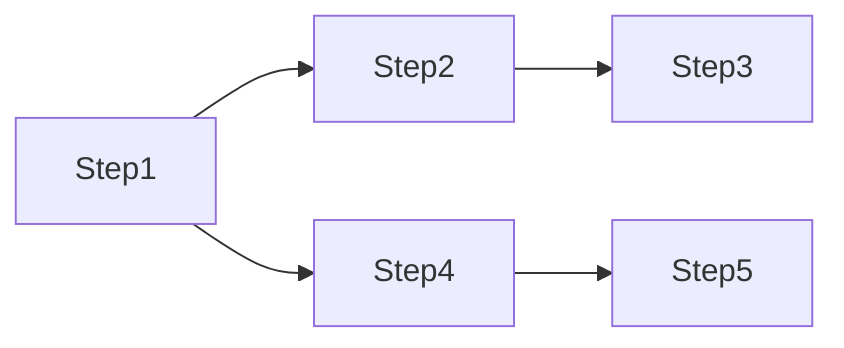
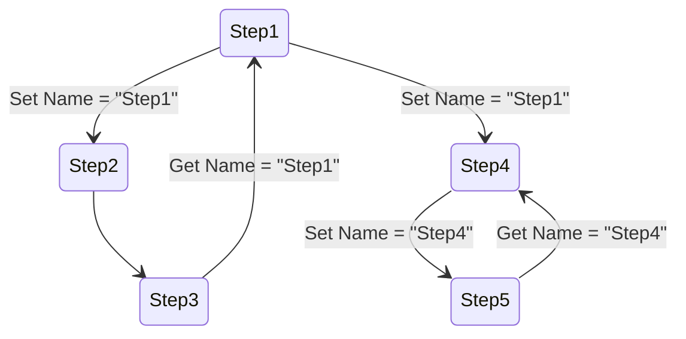

### Context

#### 1. 简介

在 Light-Flow 中，`Context` 是一个用于在 `Step` 之间传递信息的键值对存取对象。它为任务流中的步骤提供了一种有序的信息传递方式，允许某个 `Step` 将信息存储为键值对，并确保只有其关联的后续 `Step` 能够访问这些信息。

通过这种设计，`Context` 使得每个 `Step` 都能优先获取最直接相关的前置 `Step` 设置的值，避免了不相关步骤之间的数据干扰，确保了信息传递的准确性和有效性。

------

#### 2. Context 的基本层级

`Context` 在 `Light-Flow` 中分为三个层级，它们分别在不同的范围内进行数据存取：

1. **InputContext**：

   - 初始输入的数据存储在 `InputContext` 中，`Process` 和 `Step` 都可以访问这些数据。

2. **Process 的 Context**

   - `Process` 可以存储并访问由 `Process` 设置的键值，同时也可以访问 `InputContext` 中的数据。

3. **Step 的 Context**：

   - 每个 `Step` 可以存储自己的键值，访问 `InputContext` 和其所属 `Process` 的 `Context`。在同一 `Process` 中，`Step` 之间可以共享相关联步骤的 `Context` 数据。

   ```mermaid
   flowchart TD
       A[InputContext] --> B[ProcessContext]
       B --> C[Step2Context]
       B --> D[Step1Context]
       C --> E[Set/Get data]
       D --> F[Set/Get data]
   
       A:::contextStyle
       B:::contextStyle
       C:::stepStyle
       D:::stepStyle
   
       classDef contextStyle fill:#f9f,stroke:#333,stroke-width:2px;
       classDef stepStyle fill:#9f9,stroke:#333,stroke-width:2px;
   ```

------

#### 3. Context 的连通与隔离

假设执行路径如下：



在该流程中，**Step1** 和 **Step4** 都在 `Context` 中设置了 `Name` 键，值分别为各自步骤的名称。以下是各步骤对 `Name` 键值的访问情况：




如图所示，**Step3** 获取的是从 **Step1** 传递的 `Name` 值，而 **Step5** 则获取到的是从 **Step4** 传递的 `Name` 值，保证了信息传递的隔离性。

------

#### 4. 极端情况处理

##### 4.1 Restrict

`Restrict` 是 `Context` 的一种补充功能，允许指定某个 `Step` 只能从特定的前置 `Step` 获取指定的键值。适用于多个前置 `Step` 设置相同键时避免数据冲突的情况。

##### 4.2 GetEndValues

`GetEndValues` 用于获取当前步骤执行路径上的末端键值对，特别适合在合并路径中处理多个步骤设置相同键的情况。

**特性**：

- **末端值**：如果某个键在执行路径中没有被后续步骤覆盖，则该键的值被视为末端值。
- **多值支持**：在合并路径中，若多个步骤设置了相同的键，`GetEndValues` 会返回这些步骤的末端值集合。

------

#### 5. 示例

以下是一些极端场景的示例：

1. **顺序路径**：`Step1 -> Step2 -> Step3`，`Step3` 调用 `GetEndValues()`。

- 如果 `Step1` 和 `Step2` 都设置了 `Name`，则 `GetEndValues` 返回 `Step2` 的 `Name` 值（即最新设置的值）。

1. **合并路径**：`Step1 -> Step3` 与 `Step2 -> Step3`，`Step3` 调用 `GetEndValues()`。

- 如果 `Step1` 和 `Step2` 都设置了 `Name`，`GetEndValues` 返回这两个步骤的末端 `Name` 值的集合。

------

