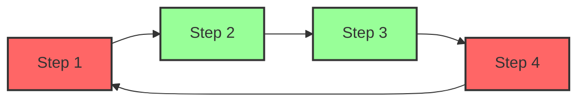

### Merge 

#### 概述

Light-Flow支持将已注册的 `Process` **合并**到正在编排的 `Process` 中。通过 Merge 功能，用户可以复用现有流程并将其无缝集成到当前任务流中。合并过程中，执行步骤、配置和条件等都会自动调整，确保合并后的流程能够正常运行。如果检测到执行顺序中的环（循环依赖），系统会触发 `Panic` 并指出环的具体位置。

[条件执行文档](./Condition.cn.md) [配置文档](./Configuration.cn.md)

---

#### Merge 功能介绍

- **步骤合并**：当一个已注册的 `Process` 被合并时，框架会自动调整执行步骤的顺序。如果某个步骤在当前 `Process` 中不存在，系统会自动补充，确保流程完整性。

  **示例**：

  已注册的 `Process A` 执行流程如下：

  ```mermaid
  flowchart LR;
      A["Step 1"]-->B["Step 2"];
      B --> C["Step 3"];
      C --> D["Step 5"];
  classDef default fill:#98FF98,stroke:#333,stroke-width:2px;
  ```
  
  正在编排的 `Process B` 执行流程如下：
  
  ```mermaid
  flowchart LR;
      A["Step 2"]-->B["Step 3"];
      C["Step 4"] --> D["Step 5"]
  classDef default fill:#98FF98,stroke:#333,stroke-width:2px;
  ```

  `Process B` Merge `Process A` 后的执行流程如下：
  
  ```mermaid
  flowchart LR;
      A["Step 1"]-->B["Step 2"];
      B --> C["Step 3"];
      C --> D["Step 5"];
      E["Step 4"] --> D
  classDef default fill:#98FF98,stroke:#333,stroke-width:2px;
  ```

**示例**：

```go
import (
	"fmt"
	"github.com/Bilibotter/light-flow/flow"
	"strings"
)

func Step1(step flow.Step) (any, error) {
	fmt.Printf("Executing [Step: %s], Dependents= [%s]\n", step.Name(), strings.Join(step.Dependents(), ", "))
	return nil, nil
}

// Similar functions for Step2, Step3, Step4, Step5

func init() {
	merged := flow.FlowWithProcess("A")
	merged.Follow(Step1, Step2, Step3, Step5)

	target := flow.FlowWithProcess("B")
	target.Merge("A") // Merge Process A into Process B
	target.Follow(Step2, Step3)
	target.Follow(Step4, Step5)
}

func main() {
	flow.DoneFlow("B", nil) // Execute the merged process
}
```

- **配置合并**：合并过程中，步骤相关的配置和条件也会被自动合并。对于如 `StepTimeout` 等配置，框架提供优先级继承机制，确保合理的配置覆盖逻辑。

**示例**：

```go
merged := flow.FlowWithProcess("A")
step := merged.CustomStep(Step2, "Step1")
step.EQ("temperature", 30)
step.Restrict(map[string]any{"Key": Step2})
step.StepTimeout(5 * time.Minute) // Set timeout for Step1

target := flow.FlowWithProcess("B")
target.Merge("A") // Merge Process A into Process B
target.Follow(Step1)
```

---

#### 配置优先级

合并时，配置的优先级遵循以下顺序：

1. **当前 `Step` 的设置**（最高优先级）
2. **当前 `Process` 的设置**
3. **当前 `Flow` 的设置**
4. **Merge 进来的 `Step` 的设置**
5. **全局默认配置**（最低优先级）

这种优先级机制允许用户在更精细的层级进行配置，灵活控制任务行为，同时保留合并流程的配置。

---

#### 条件合并

合并时，框架还会合并 `Step` 的执行条件。每个步骤的执行条件定义了该步骤在特定条件下才会执行。通过合并，这些条件会被保留并应用于合并后的 `Process` 中，确保执行逻辑不受影响。

---

#### 环检测机制

在合并过程中，框架自动检测 `Step` 之间是否存在环。如果出现环（即循环依赖），系统会立即触发 `Panic`，并指出构成环的两个 `Step`，帮助用户迅速定位并解决问题。

**示例**：

如果 `Step1 -> Step2 -> Step3 -> Step4 -> Step1` 构成了环，系统会抛出异常并指出 `Step4 -> Step1` 之间存在循环。



---

#### Merge 的操作步骤

1. **注册 `Process`**：在合并之前，确保要合并的 `Process` 已被注册。
2. **执行 Merge**：通过框架提供的接口，将已注册的 `Process` 合并到当前编排中的 `Process`。
3. **调整执行顺序**：系统会自动调整执行顺序，并检测是否存在步骤缺失，确保流程完整。
4. **环检测**：检测到环时，系统会触发 `Panic`，并提供详细的错误信息。

