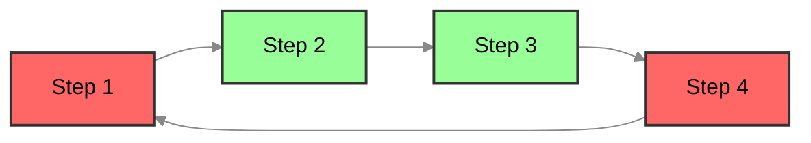

### Merge

#### Overview

Light-Flow supports merging registered `Processes` into the currently orchestrated `Process`. With the Merge feature, users can reuse existing workflows and seamlessly integrate them into the current task flow. During the merge process, execution steps, configurations, and conditions are automatically adjusted to ensure that the merged workflow operates correctly. If a cycle (circular dependency) is detected in the execution order, the system will trigger a `Panic` and indicate the specific location of the cycle.

[See Condition Documentation](./Condition.en.md) [See Configuration Documentation](./Configuration.en.md)

---

#### Introduction to Merge Functionality

- **Step Merging**: When a registered `Process` is merged, the framework automatically adjusts the order of execution steps. If a step is missing in the current `Process`, the system will automatically include it to ensure workflow completeness.

  **Example**:

  The execution flow of registered `Process A` is as follows:

  ```mermaid
  %%{init: {'theme': 'neutral', 'themeVariables': { 'primaryColor': '#333', 'lineColor': '#333', 'textColor': 'black' } } }%%
  flowchart LR;
      A["Step 1"]-->B["Step 2"];
      B --> C["Step 3"];
      C --> D["Step 5"];
  linkStyle default stroke:#888888
  classDef default fill:#98FF98,stroke:#333,stroke-width:2px;
  ```
  
  The execution flow of the currently orchestrated `Process B` is as follows:
  
  ```mermaid
  %%{init: {'theme': 'neutral', 'themeVariables': { 'primaryColor': '#333', 'lineColor': '#333', 'textColor': 'black' } } }%%
  flowchart LR;
      A["Step 2"]-->B["Step 3"];
      C["Step 4"] --> D["Step 5"]
  linkStyle default stroke:#888888
  classDef default fill:#98FF98,stroke:#333,stroke-width:2px;
  ```
  
  After merging `Process A` into `Process B`, the execution flow becomes:
  
  ```mermaid
  %%{init: {'theme': 'neutral', 'themeVariables': { 'primaryColor': '#333', 'lineColor': '#333', 'textColor': 'black' } } }%%
  flowchart LR;
      A["Step 1"]-->B["Step 2"];
      B --> C["Step 3"];
      C --> D["Step 5"];
      E["Step 4"] --> D
  linkStyle default stroke:#888888
  classDef default fill:#98FF98,stroke:#333,stroke-width:2px;
  ```

**Example**:

```go
import (
	"fmt"
	"github.com/Bilibotter/light-flow/flow"
	"strings"
)

func Step1(step flow.Step) (any, error) {
	fmt.Printf("Executing [Step: %s], Dependents= [%s]\n", step.Name(), strings.Join(step.Dependents(), ", "))
	return nil, nil
}

// Similar functions for Step2, Step3, Step4, Step5

func init() {
	merged := flow.FlowWithProcess("A")
	merged.Follow(Step1, Step2, Step3, Step5)

	target := flow.FlowWithProcess("B")
	target.Merge("A") // Merge Process A into Process B
	target.Follow(Step2, Step3)
	target.Follow(Step4, Step5)
}

func main() {
	flow.DoneFlow("B", nil) // Execute the merged process
}
```

- **Configuration Merging**: During the merge process, step-related configurations and conditions are also automatically merged. For configurations like `StepTimeout`, the framework provides a priority inheritance mechanism to ensure reasonable configuration overrides.

**Example**:

```go
merged := flow.FlowWithProcess("A")
step := merged.CustomStep(Step2, "Step1")
step.EQ("temperature", 30)
step.Restrict(map[string]any{"Key": Step2})
step.StepTimeout(5 * time.Minute) // Set timeout for Step1

target := flow.FlowWithProcess("B")
target.Merge("A") // Merge Process A into Process B
target.Follow(Step1)
```

---

#### Configuration Priority

During merging, configuration priorities follow this order:

1. **Current Step's Settings** (highest priority)
2. **Current Process's Settings**
3. **Current Flow's Settings**
4. **Merged-in Step's Settings**
5. **Global Default Configuration** (lowest priority)

This priority mechanism allows users to configure at a more granular level, providing flexible control over task behavior while retaining configurations from merged workflows.

---

#### Conditional Merging

During merging, the framework also merges the execution conditions of each `Step`. These conditions define when a step will execute under specific circumstances. By merging these conditions, they are preserved and applied to the merged `Process`, ensuring that execution logic remains unaffected.

---

#### Cycle Detection Mechanism

The framework automatically checks for cycles between `Steps` during the merge process. If a cycle (i.e., circular dependency) is detected, the system will immediately trigger a `Panic` and point out the two `Steps` that form the cycle, helping users quickly locate and resolve issues.

**Example**:

If `Step1 -> Step2 -> Step3 -> Step4 -> Step1` forms a cycle, the system will throw an exception indicating that there is a loop between `Step4 -> Step1`.



---

#### Steps for Performing Merge

1. **Register Processes**: Ensure that any `Processes` you want to merge have been registered beforehand.
2. **Execute Merge**: Use the framework's interface to merge registered `Processes` into the currently orchestrated `Process`.
3. **Adjust Execution Order**: The system will automatically adjust execution order and check for any missing steps to ensure workflow completeness.
4. **Cycle Detection**: If a cycle is detected, the system will trigger a `Panic` and provide detailed error information.