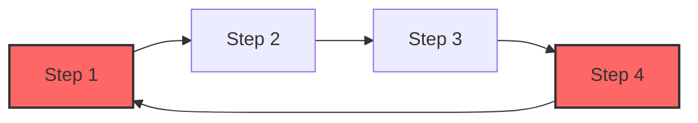

### Merge 特性使用文档

#### 概述

任务编排框架支持将已注册的 `Process` **合并（Merge）**到正在编排的 `Process` 中。通过 Merge 功能，用户可以复用现有流程，并将其无缝集成到当前任务流中。Merge 过程中，执行步骤、配置、条件等都会被自动调整，确保合并后的流程能够正常执行。如果 Merge 过程中检测到执行顺序中的环（循环依赖），系统将触发 `Panic` 并指出环的具体位置。

---

#### Merge 功能介绍

- **步骤的合并**：当一个已注册的 `Process` 被合并到当前的 `Process` 中时，框架会自动调整执行步骤的顺序。如果某个步骤在当前 `Process` 中不存在，系统会自动补充该步骤，确保合并后流程的完整性。

  **示例**：

  已注册的 `Process A` 的执行流程如下：

  ```mermaid
  flowchart LR;
      A["Step 1"]-->B["Step 2"];
      B --> C["Step 3"];
      C --> D["Step 5"];
  ```

  正在编排的 `Process B` 的执行流程如下：

  ```mermaid
  flowchart LR;
      A["Step 2"]-->B["Step 3"];
      C["Step 4"] --> D["Step 5"]
  ```

  `Process B` Merge `Process A` 后的执行流程如下：

  ```mermaid
  flowchart LR;
      A["Step 1"]-->B["Step 2"];
      B --> C["Step 3"];
      C --> D["Step 5"];
      E["Step 4"] --> D
  ```

  

- **配置的合并**：Merge 过程中，不仅步骤会被合并，步骤相关的配置和条件也会被合并进来。对于类似 `StepTimeout` 等配置，框架提供多级优先级继承机制，确保在不同层级（`Step`、`Process`、`Flow`）中有合理的配置覆盖逻辑。

---

#### 配置优先级

在合并过程中，框架会处理步骤的配置合并，配置的获取遵循以下优先级顺序：

1. **当前 `Step` 的设置**（最高优先级）
2. **当前 `Process` 的设置**
3. **当前 `Flow` 的设置**
4. **Merge 进来的 `Step` 的设置**
5. **全局默认配置**（最低优先级）

这一优先级保证了用户可以在更精细的层级上进行配置，灵活控制任务行为，同时也允许 Merge 进来的流程保留其配置，除非被显式覆盖。

------

#### 条件合并

在 `Merge` 时，框架还会合并 `Step` 的执行条件。每个 `Step` 的执行条件定义了该步骤在满足特定条件时才会执行。通过 `Merge`，这些条件会被保留并正确应用到合并后的 `Process` 中，确保任务执行逻辑不受影响。~~条件文档~~

---

#### 环检测机制

在合并过程中，框架会自动检测 `Step` 之间是否存在环。如果出现执行顺序中的环（即循环依赖），系统会立即触发 `Panic`，并详细指出构成环的两个 `Step`，帮助用户迅速定位并解决问题。

**示例**：

如果 `Step1 -> Step2 -> Step3 -> Step4 -> Step1` 构成了环，系统会抛出异常并指出 `Step4 -> Step1` 之间存在循环。



---

#### Merge 的操作步骤

1. **注册 `Process`**：在合并之前，确保要合并的 `Process` 已被注册。
2. **执行 Merge**：通过框架提供的接口，将已注册的 `Process` 合并到当前编排中的 `Process`。
3. **调整执行顺序**：系统会自动调整合并后的执行顺序，并检测是否存在步骤缺失，确保流程完整。
4. **处理环检测**：如果检测到执行环，系统会自动触发 `Panic`，并提供详细的错误信息。

---

#### 总结

Merge 特性允许用户轻松复用已注册的 `Process`，并将其无缝合并到当前任务流中，自动调整执行顺序、合并配置和条件。系统具备灵活的配置优先级机制，并在合并过程中提供环检测功能，确保合并后的流程能够稳定执行。
