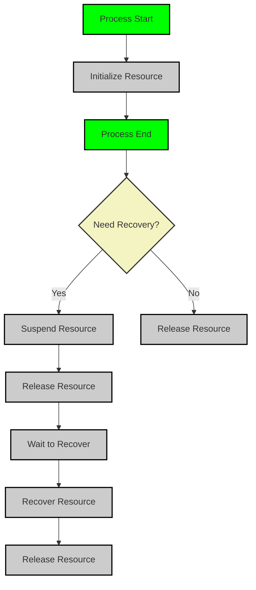

# Resource

#### 概述

Light-Flow 的资源管理功能允许用户在任务 `Step` 中使用外部资源（例如数据库连接、API 客户端等），并确保这些资源在任务执行期间正确初始化、挂起、恢复和释放。资源管理支持自动化的生命周期控制，确保在任务中断或恢复时，资源状态能够正确保存和恢复。

> **重要说明**：**资源不一定要有实体**，它们可以用于抽象外部系统。凡是对断点恢复有特定恢复操作的外部系统都可以做成资源，然后附加进流程里面。

---

#### 资源注册

在使用资源之前，必须将其注册到资源管理器中。注册后，可以将资源附加到 `Process`，并由框架自动管理。

- **注册资源**：使用 `AddResource` 方法将资源注册到资源管理器。

  **示例**

  ```go
  flow.AddResource("Resource") // Register the resource
  ```

- **附加资源**：通过 `Attach` 方法将资源附加到 `Process` 中。附加时，可以传入 `initParam` 作为资源 `Initialize` 方法的输入，返回值将作为后续使用的资源实体。

  **示例**

  ```go
  func Step(step flow.Step) (any, error) {
      res, err := step.Attach("resource", "initParam") // Attach the resource with initialization parameters
      if err != nil {
          return nil, err
      }
  }
  ```

---

#### 资源生命周期管理

资源在 `Process` 中的生命周期包括以下四个关键操作：

- **Initialize**：资源附加后，框架自动调用 `Initialize` 方法，确保资源在任务执行前正确初始化。
- **Release**：无论任务成功还是失败，`Process` 执行结束后，系统会自动调用 `Release` 方法，释放资源以避免泄漏。
- **Suspend（挂起）**：任务中断或保存检查点时，框架调用 `Suspend` 方法保存当前资源状态。此操作通常用于清除敏感数据并保存恢复所需的信息（如用户ID、会话ID等）。用户无需手动持久化，框架会自动处理。
- **Recover（恢复）**：任务恢复时，系统通过 `Recover` 方法使用 `Suspend` 保存的信息恢复资源状态，确保资源能够正确加载并支持任务继续执行。

[Recover文档](./Recover.cn.md)

这些操作由框架自动管理，无需用户手动调用。

**示例**

```go
flow.AddResource("Resource").
    OnInitialize(InitializeMethod). // Set the initialization method
    OnSuspend(SuspendMethod).         // Set the suspend method
    OnRelease(ReleaseMethod).         // Set the release method
    OnRecover(RecoverMethod)          // Set the recovery method
```

---

#### 资源使用

`OnInitialize`、`OnSuspend`、`OnRelease`、`OnRecover` 方法的参数都是一个 `Resource` 对象。

`Resource` 提供以下主要方法：

- **Put**：向 `Resource` 写入键值。
- **Fetch**：从 `Resource` 读取键值。
- **Entity**：获取 `OnInitialize` 生成的资源实体。
- **Update**：更新资源实体。
- **Clear**：清空资源实体及其键值。
- **Has、Success**：用于判断 `Process` 的状态。

**示例1：不支持断点恢复的连接**

```go
type UnRecoverConnect struct {
	*gorm.DB
}

func (u *UnRecoverConnect) OnInitialize(res flow.Resource, _ any) (entity any, err error) {
	fmt.Printf("[Process: %s] initializing [Resource: %s]\n", res.ProcessName(), res.Name()) // Log initialization
	tx := u.DB.Begin() // Begin a new transaction
	return tx, nil
}

func (u *UnRecoverConnect) OnRelease(res flow.Resource) error {
	fmt.Printf("[Process: %s] releasing [Resource: %s]\n", res.ProcessName(), res.Name()) // Log resource release
	if res.Success() {
		return res.Entity().(*gorm.DB).Commit().Error // Commit if successful
	}
	return res.Entity().(*gorm.DB).Rollback().Error // Rollback if not successful
}
```

**示例2：支持断点恢复的连接**

```go
type RecoverConnect struct {
	*gorm.DB
}

func (r *RecoverConnect) OnInitialize(res flow.Resource, initParam any) (any, error) {
	tx := r.Begin() // Begin a new transaction
	return tx, nil
}

func (r *RecoverConnect) OnRelease(res flow.Resource) error {
	// Since this resource can be recovered, there's no need to rollback on exception
	return r.Commit().Error // Commit changes
}
```

---

#### 时效性资源管理

某些时效性资源（如临时令牌、会话等）在任务恢复时可能已失效。为了确保恢复时这些资源的有效性，用户需要在 `Suspend` 方法中保存重新生成这些资源所需的信息，并在 `Recover` 方法中使用这些信息。

#### 清理敏感数据

在 `Suspend` 方法中，使用 `Clear` 方法清理敏感数据，以确保不被持久化。接下来，通过 `Put` 方法保存恢复所需的关键信息，如用户ID或其他凭证数据。

#### 重新生成资源

在 `Recover` 方法中，使用 `Fetch` 方法获取在 `Suspend` 时保存的关键信息，根据这些信息重新生成时效性资源，并调用 `Update` 方法将新的资源注入到 `Process` 中，以便任务正常恢复。

**示例**

```go
func PasswordInit(res flow.Resource, initParam any) (any, error) {
	pwd := GetPassWordByUserID(initParam.(string)) // Fetch password based on user ID
	res.Put("userId", initParam.(string)) // Store user ID for recovery
	return pwd, nil
}

func PasswordSuspend(res flow.Resource) error {
	// Save userId; Clear will remove the userId from the resource
	userId, exist := res.Fetch("userId")
	if !exist {
		return fmt.Errorf("userId not exist") // Error if userId not found
	}
	res.Clear() // Clear sensitive data
	res.Put("userId", userId) // Preserve userId for recovery
	return nil
}

func PasswordRecover(res flow.Resource) error {
	userId, exist := res.Fetch("userId") // Retrieve userId
	if !exist {
		return fmt.Errorf("userId not exist") // Error if userId not found
	}
	pwd := GetPassWordByUserID(userId.(string)) // Fetch password again
	res.Update(pwd) // Update the resource with new password
	return nil
}

flow.AddResource("Password").
    OnInitialize(PasswordInit). // Set initialization for password
    OnSuspend(PasswordSuspend).   // Set the suspend method
    OnRelease(PasswordRecover)     // Set the recovery method
```

---

#### 资源的断点恢复顺序

启用断点恢复时，资源的恢复遵循以下顺序：

1. **Initialize Res**：任务开始执行前初始化资源。
2. **Process Error**：任务执行过程中发生错误或异常。
3. **Suspend Res**：挂起资源，保存恢复所需的信息。
4. **Release Res**：在任务失败后释放资源。
5. **Recover Process**：恢复任务流程。
6. **Recover Res**：任务恢复后，恢复资源状态。
7. **Process Success**：任务恢复成功后继续执行任务。
8. **Release Res**：任务完成后释放所有资源。

资源的生命周期流程图如下：



---

#### 资源方法的实现

根据实际需求，用户可以选择性实现 `Initialize`、`Suspend`、`Recover` 和 `Release` 方法。对于不需要挂起或恢复的资源，这些方法可以省略，框架会自动处理其他生命周期操作。

