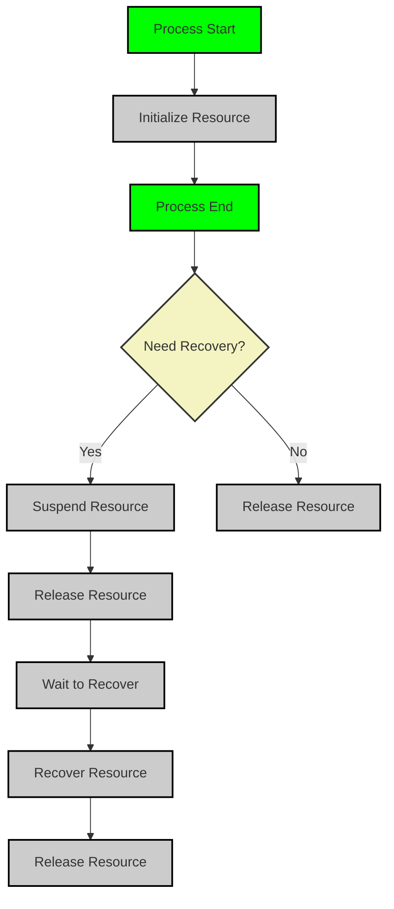

# Resource

#### Overview

Light-Flow's resource management feature allows users to utilize external resources (such as database connections, API clients, etc.) within task `Steps`, ensuring these resources are correctly initialized, suspended, recovered, and released during task execution. Resource management supports automated lifecycle control, ensuring that resource states are properly saved and restored when tasks are interrupted or recovered.

> **Important Note**: **Resources do not need to have a  entity**; they can be used to abstract external systems. Any external system that requires specific recovery operations for checkpoint recovery can be treated as a resource and attached into the workflow.

---

#### Resource Registration

Before using a resource, it must be registered with the resource manager. Once registered, resources can be attached to a `Process`, and the framework will manage them automatically.

- **Registering Resources**: Use the `AddResource` method to register a resource with the resource manager.

  **Example**

  ```go
  flow.AddResource("Resource") // Register the resource
  ```

- **Attaching Resources**: Use the `Attach` method to attach a resource to a `Process`. When attaching, you can pass `initParam` as input for the resource's `Initialize` method; the return value will be used as the resource entity for subsequent operations.

  **Example**

  ```go
  func Step(step flow.Step) (any, error) {
      res, err := step.Attach("resource", "initParam") // Attach the resource with initialization parameters
      if err != nil {
          return nil, err
      }
  }
  ```

---

#### Resource Lifecycle Management

The lifecycle of resources within a `Process` includes four key operations:

- **Initialize**: After a resource is attached, the framework automatically calls the `Initialize` method to ensure that the resource is correctly initialized before task execution.
- **Release**: Regardless of whether the task succeeds or fails, after the `Process` execution ends, the system automatically calls the `Release` method to free up resources and avoid leaks.
- **Suspend**: When a task is interrupted or a checkpoint is saved, the framework calls the `Suspend` method to save the current state of resources. This operation is typically used to clear sensitive data and save information needed for recovery (such as user IDs or session IDs). Users do not need to handle persistence manually; the framework manages it automatically.
- **Recover**: During task recovery, the system uses information saved during `Suspend` via the `Recover` method to restore resource states, ensuring that resources can be correctly loaded and support task continuation.

[See Recover Documentation](./Recover.en.md)

These operations are managed automatically by the framework without requiring manual invocation by users.

**Example**

```go
flow.AddResource("Resource").
    OnInitialize(InitializeMethod). // Set the initialization method
    OnSuspend(SuspendMethod).         // Set the suspend method
    OnRelease(ReleaseMethod).         // Set the release method
    OnRecover(RecoverMethod)          // Set the recovery method
```

---

#### Resource Usage

The parameters for `OnInitialize`, `OnSuspend`, `OnRelease`, and `OnRecover` methods are all `Resource` objects.

The `Resource` provides several main methods:

- **Put**: Write key-value pairs into the `Resource`.
- **Fetch**: Read key-value pairs from the `Resource`.
- **Entity**: Retrieve the resource entity generated during `OnInitialize`.
- **Update**: Update the resource entity.
- **Clear**: Clear both the resource entity and its key-value pairs.
- **Has, Success**: Used to determine the status of a `Process`.

**Example 1: Connection Without Checkpoint Recovery**

```go
type UnRecoverConnect struct {
	*gorm.DB
}

func (u *UnRecoverConnect) OnInitialize(res flow.Resource, _ any) (entity any, err error) {
	fmt.Printf("[Process: %s] initializing [Resource: %s]\n", res.ProcessName(), res.Name()) // Log initialization
	tx := u.DB.Begin() // Begin a new transaction
	return tx, nil
}

func (u *UnRecoverConnect) OnRelease(res flow.Resource) error {
	fmt.Printf("[Process: %s] releasing [Resource: %s]\n", res.ProcessName(), res.Name()) // Log resource release
	if res.Success() {
		return res.Entity().(*gorm.DB).Commit().Error // Commit if successful
	}
	return res.Entity().(*gorm.DB).Rollback().Error // Rollback if not successful
}
```

**Example 2: Connection With Checkpoint Recovery**

```go
type RecoverConnect struct {
	*gorm.DB
}

func (r *RecoverConnect) OnInitialize(res flow.Resource, initParam any) (any, error) {
	tx := r.Begin() // Begin a new transaction
	return tx, nil
}

func (r *RecoverConnect) OnRelease(res flow.Resource) error {
	// Since this resource can be recovered, there's no need to rollback on exception
	return r.Commit().Error // Commit changes
}
```

---

#### Time-sensitive Resource Management

Certain time-sensitive resources (like temporary tokens or sessions) may expire during task recovery. To ensure these resources are valid upon recovery, users need to save information required to regenerate these resources in the `Suspend` method and use that information in the `Recover` method.

#### Clearing Sensitive Data

In the `Suspend` method, use the `Clear` method to remove sensitive data to ensure it is not persisted. Then use the `Put` method to save critical information needed for recovery, such as user IDs or other credential data.

#### Regenerating Resources

In the `Recover` method, use the `Fetch` method to retrieve critical information saved during `Suspend`. Based on this information, regenerate time-sensitive resources and call the `Update` method to inject new resources into the `Process`, allowing tasks to recover smoothly.

**Example**

```go
func PasswordInit(res flow.Resource, initParam any) (any, error) {
	pwd := GetPassWordByUserID(initParam.(string)) // Fetch password based on user ID
	res.Put("userId", initParam.(string)) // Store user ID for recovery
	return pwd, nil
}

func PasswordSuspend(res flow.Resource) error {
	// Save userId; Clear will remove userId from resource
	userId, exist := res.Fetch("userId")
	if !exist {
		return fmt.Errorf("userId not exist") // Error if userId not found
	}
	res.Clear() // Clear sensitive data
	res.Put("userId", userId) // Preserve userId for recovery
	return nil
}

func PasswordRecover(res flow.Resource) error {
	userId, exist := res.Fetch("userId") // Retrieve userId
	if !exist {
		return fmt.Errorf("userId not exist") // Error if userId not found
	}
	pwd := GetPassWordByUserID(userId.(string)) // Fetch password again
	res.Update(pwd) // Update resource with new password
	return nil
}

func init() {
	flow.AddResource("Password").
		OnInitialize(PasswordInit).
		OnSuspend(PasswordSuspend).
		OnRelease(PasswordRecover)
}
```

---

#### Order of Resource Checkpoint Recovery

When checkpoint recovery is enabled, resources are restored in the following order:

1. **Initialize Res**: Initialize resources before task execution begins.
2. **Process Error**: Errors or exceptions occur during task execution.
3. **Suspend Res**: Suspend resources and save necessary information for recovery.
4. **Release Res**: Release resources after task failure.
5. **Recover Process**: Recover task workflow.
6. **Recover Res**: Restore resource states after task recovery.
7. **Process Success**: Continue executing tasks after successful recovery.
8. **Release Res**: Release all resources after task completion.

The lifecycle flowchart of resources is as follows:



---

#### Implementing Resource Methods

Depending on actual needs, users can selectively implement methods like `Initialize`, `Suspend`, `Recover`, and `Release`. For resources that do not require suspension or recovery, these methods can be omitted; the framework will automatically handle other lifecycle operations.