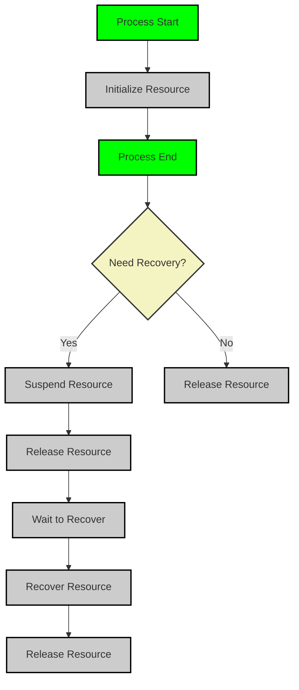

### 资源管理特性使用文档

#### 概述

Light-Flow 的资源管理功能允许用户在任务 `Step` 中使用外部资源（如数据库连接、API 客户端等），并确保这些资源在任务执行期间得到正确的初始化、挂起、恢复和释放。资源管理支持自动化生命周期控制，且资源能够参与断点恢复，确保任务中断或恢复时资源状态的正确保存与恢复。

---

#### 资源的注册

在使用资源之前，必须先将资源注册到资源管理器中，随后可将其附加到 `Process`，并由框架自动管理。

- **注册资源**：使用 `Register` 方法将资源注册到资源管理器中。
- **附加资源**：通过 `Attach` 方法将资源附加到 `Process` 中。附加时，可以传入 `initParam` 作为资源 `Initialize` 方法的输入，`Initialize` 方法的返回值将作为资源的实体对象供后续使用。

---

#### 资源的生命周期管理

资源在 `Process` 中的生命周期由以下四个关键操作组成：

- **Initialize**：资源被附加到 `Process` 后，框架会自动调用 `Initialize` 方法，确保资源在任务开始执行前被正确初始化。

- **Release**：`Process` 执行结束后，无论任务成功或失败，系统会自动调用 `Release` 方法，释放资源以避免资源泄漏。

- **Suspend（挂起）**：当任务执行中断或保存检查点时，框架会调用资源的 `Suspend` 方法保存资源的当前状态。此操作通常用于清除敏感数据并保存用于恢复的信息（如用户ID、会话ID等）。用户无需手动持久化资源，框架会自动处理持久化过程。

- **Recover（恢复）**：任务恢复时，系统通过 `Recover` 方法使用 `Suspend` 时保存的信息恢复资源状态，确保资源能够正确加载并支持任务继续执行。

这些生命周期操作由框架自动管理，用户无需手动调用。

---

#### 时效性资源的管理

对于某些时效性资源（如临时令牌、会话等），这些资源在任务恢复时可能已失效。为了确保恢复时资源的有效性，用户需要在 `Suspend` 方法中保存重新生成这些资源所需的信息，并在 `Recover` 方法中使用这些信息重新生成资源。

- **清理敏感数据**：在 `Suspend` 方法中，应使用 `Clear` 方法清理敏感数据，确保其不会被持久化。随后，可以通过 `Put` 方法保存资源恢复所需的关键信息，如用户ID或其他凭证数据。

- **重新生成资源**：在 `Recover` 方法中，使用 `Fetch` 方法获取 `Suspend` 时保存的关键信息，根据这些信息重新生成时效性资源，最后调用 `Update` 方法将新的资源注入到 `Process` 中，以便任务正常恢复。

---

#### 资源的断点恢复顺序

当启用断点恢复时，资源的恢复遵循以下顺序：

1. **Initialize Res**：任务开始执行前初始化资源。
2. **Process Error**：任务执行过程中发生错误或异常。
3. **Suspend Res**：挂起资源，保存恢复所需的信息。
4. **Release Res**：在任务失败后释放资源。
5. **Recover Process**：恢复任务流程。
6. **Recover Res**：任务恢复后，恢复资源状态。
7. **Process Success**：任务恢复成功后继续执行任务。
8. **Release Res**：任务完成后释放所有资源。

资源的生命周期流程图如下：

---

#### 资源方法的实现

根据实际需求，用户可以选择性实现 `Initialize`、`Suspend`、`Recover` 和 `Release` 方法。对于不需要挂起或恢复的资源，这些方法可以省略，框架会自动处理其他生命周期操作。

---

### 总结

资源管理功能为用户提供了便捷的生命周期管理机制，支持资源的自动化初始化、挂起、恢复和释放。特别是在断点恢复场景中，资源的状态能够被正确保存和恢复，确保任务中断后可以无缝继续执行。用户可根据具体需求灵活实现所需的资源管理方法，以确保任务的安全性和高效性。
